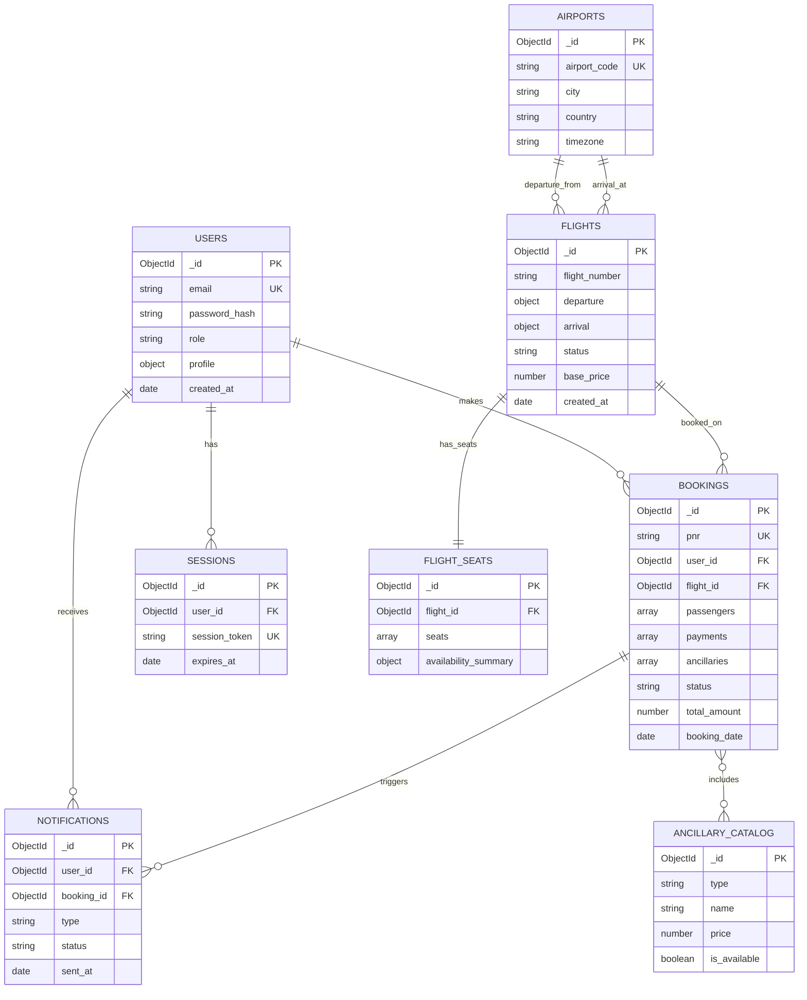

# Technical Specifications Document

## 1. Title Page
**Project Name:** Airline Booking System  
**Version:** 1.2  
**Date:** November 7, 2025  
**Author(s):**
- Rey Jesus M. Teves
- Jan Chelsea Lavaro
- Darwin Besorio
- Rex Bugcalao
- Cristino France Madali
- Manuel P Buenviaje II

---

## 2. Table of Contents
1. [Introduction](#3-introduction)
2. [Overall Description](#4-overall-description)
3. [Visual Mockup Reference](#5-visual-mockup-reference)
4. [Features](#6-features)
5. [Functional Requirements](#7-functional-requirements)
6. [Non-Functional Requirements](#8-non-functional-requirements)
7. [Data Requirements](#9-data-requirements)
8. [External Interface Requirements](#10-external-interface-requirements)
9. [Technology Stack](#11-technology-stack)
10. [Security Requirements](#12-security-requirements)
11. [Testing Strategy](#13-testing-strategy)
12. [Deployment Strategy](#14-deployment-strategy)
13. [Glossary](#15-glossary)
14. [Appendices](#16-appendices)

---

## 3. Introduction

### 3.1 Purpose
To develop a comprehensive airline booking system that enables users to search for flights, book tickets, purchase add-ons, and manage their bookings efficiently. The system aims to provide a seamless booking experience for customers while offering robust management tools for airline staff.

### 3.2 Scope

#### In Scope (MVP - Version 1.0)
- User registration and authentication
- Flight search by date, origin, and destination
- Flight booking and ticket generation
- Passenger information management
- Ancillary service purchase (meals, shop items, baggage fees)
- Payment processing via integrated gateway
- Booking viewing and cancellation
- Email notifications
- Admin panel for flight and booking management

#### Out of Scope (Future Versions)
- Multi-city bookings
- Loyalty programs and frequent flyer miles
- Advanced seat selection (planned for Phase 5)
- Real-time flight tracking
- Mobile native applications
- Multi-language support
- Travel insurance integration

### 3.3 Definitions, Acronyms, and Abbreviations
- **PNR:** Passenger Name Record - unique identifier for a booking
- **API:** Application Programming Interface - allows systems to communicate
- **ERD:** Entity-Relationship Diagram - visual representation of database structure
- **MVP:** Minimum Viable Product - version with core features only
- **CRUD:** Create, Read, Update, Delete operations
- **JWT:** JSON Web Token - authentication mechanism
- **REST:** Representational State Transfer - API architectural style
- **HTTPS:** Hypertext Transfer Protocol Secure - encrypted HTTP
- **FK:** Foreign Key - reference to another collection
- **PK:** Primary Key - unique identifier
- **TTL:** Time To Live - expiration mechanism

---

## 4. Overall Description

### 4.1 Product Perspective
The Airline Booking System is a standalone web application designed to serve two primary user groups:
1. **Customers** - Search, book, and manage flight reservations
2. **Airline Staff** - Manage flight schedules, inventory, and bookings

The system integrates with external services for payment processing and email notifications, providing a complete end-to-end booking solution.

### 4.2 Product Functions
- Flight search by date, origin, and destination
- Booking creation and confirmation
- Ancillary service purchase (meals, shop items, baggage fees)
- User registration and login
- Payment gateway integration for ticket and add-on purchase
- Booking viewing and cancellation
- Admin panel for managing flight schedules, inventory, and bookings

### 4.3 User Classes and Characteristics

#### End Users (Customers)
- **Primary Goal:** Book flights quickly and easily
- **Technical Expertise:** Basic to intermediate computer skills
- **Frequency of Use:** Occasional (1-10 times per year)
- **Key Needs:** Simple interface, quick booking process, secure payments

#### Admin Users (Airline Staff)
- **Primary Goal:** Manage flights and bookings efficiently
- **Technical Expertise:** Intermediate to advanced computer skills
- **Frequency of Use:** Daily
- **Key Needs:** Comprehensive management tools, reporting, inventory control

### 4.4 Operating Environment
- **Client:** Modern web browsers (Chrome, Firefox, Safari, Edge)
- **Server:** Web backend (Node.js or Python) with MongoDB database
- **Hosting:** Vercel or AWS (Amazon Web Services)
- **Database:** MongoDB Atlas (cloud-hosted)

### 4.5 Assumptions and Dependencies
- Reliable internet connectivity for users
- Availability of a payment gateway API (e.g., Stripe, PayPal)
- MongoDB Atlas cloud service availability
- Email service availability (SendGrid or AWS SES)
- Modern web browser with JavaScript enabled

---

## 5. Visual Mockup Reference

### 5.1 Design Wireframes
Design wireframes/screenshots should include the following pages:
- Landing/Home
- Login/Sign-up
- Search Results
- Flight Selection/Details
- Book a Flight
- Booking Confirmation
- My Bookings
- User Profile/Account

**Live design available on Figma:** [Airline Booking System UI/UX](https://www.figma.com/make/2TIfAaviZLvRTfY95KbdWj/Airline-Booking-System-UI-UX?node-id=0-4&t=rJMVaOfTQaEewtvx-0)

### 5.2 Entity-Relationship Diagram (ERD)

The following ERD illustrates the MongoDB database schema with collections and their relationships:



**ERD Creation Tools (Free):**
- **Draw.io / Diagrams.net** (Free, web-based, recommended) - https://app.diagrams.net/
- **Mermaid** (Free, code-based, integrates with GitHub/GitLab) - https://mermaid.js.org/

**Key Schema Design Patterns:**
- **Embedded Documents:** passengers, payments, ancillaries stored within bookings
- **References:** user_id and flight_id link bookings to users and flights
- **Denormalized Data:** flight and airport information copied into bookings for performance

---

## 6. Features

The Airline Booking System is structured around the following core features:

### 6.1 Core Features
- **Landing/Home:** Provides the initial entry point and search interface
- **User Registration and Login:** Allows users to create accounts and log in securely
- **Flight Search & Results:** Allows users to find and view available flights by origin, destination, and date
- **Flight Selection/Details:** Allows users to choose a specific flight and view full details before booking
- **Booking Creation (Input Forms):** Users can select flights, provide passenger details, and finalize the booking inputs
- **Payment & Booking Confirmation:** Secure online payment integration to complete the booking, leading to a confirmation
- **Ancillary Services Purchase:** Purchase additional services (meals, baggage, shop items) during the booking process or post-booking
- **Booking Management (My Bookings):** Users can view and manage existing bookings
- **User Profile/Account:** Allows users to manage personal information and security settings

### 6.2 Feature Priority Matrix

| Feature | Priority | Phase | Status |
|---------|----------|-------|--------|
| User Registration & Login | High | 1 | Planned |
| Flight Search | High | 1 | Planned |
| Flight Details View | High | 1 | Planned |
| Create Booking | High | 2 | Planned |
| Payment Processing | High | 3 | Planned |
| Booking Confirmation | High | 2 | Planned |
| View Bookings | High | 2 | Planned |
| Cancel Booking | High | 2 | Planned |
| Ancillary Services | Medium | 4 | Planned |
| Email Notifications | High | 3 | Planned |
| Admin Panel | Medium | 1-2 | Planned |
| Seat Selection | Low | 5 | Future |

---

## 7. Functional Requirements

### 7.1 Use Cases (Core User Journeys)

#### Use Case 1: User Registration and Login
- **Description:** New users can register and existing ones can log in securely
- **Actors:** End User
- **Preconditions:** User accesses registration or login page
- **Postconditions:** User account created or user authenticated
- **Main Flow:** 
  1. User inputs email and password
  2. System validates and registers/authenticates user
  3. User accesses account dashboard
- **Alternate Flow:** Invalid input leads to error messages

#### Use Case 2: Flight Search
- **Description:** User searches for flights by origin, destination, and date
- **Actors:** End User
- **Preconditions:** User is on flight search page
- **Postconditions:** System displays available flights matching criteria
- **Main Flow:**
  1. User inputs search parameters (origin, destination, date)
  2. System queries flights database
  3. Results displayed sorted by departure time
- **Alternate Flow:** "No flights found" message if no matches

#### Use Case 3: Booking a Flight and Add-ons
- **Description:** User books a selected flight, optionally adds ancillary services, and provides payment
- **Actors:** End User, Payment Gateway
- **Preconditions:** User is logged in and has selected a flight
- **Postconditions:** Booking confirmed, ticket issued, and ancillary services purchased
- **Main Flow:**
  1. User selects flight
  2. User enters passenger info (name, DOB, passport number)
  3. User selects optional meals/baggage/shop items
  4. User makes payment
  5. System generates PNR
  6. System confirms booking
  7. System sends confirmation email
- **Alternate Flow:** Payment failure triggers error and retry option

#### Use Case 4: View and Cancel Booking
- **Description:** User views their booking history and can cancel bookings
- **Actors:** End User
- **Preconditions:** User is logged in and has existing bookings
- **Postconditions:** Booking details displayed or booking cancelled
- **Main Flow:**
  1. User navigates to "My Bookings"
  2. System displays list of bookings
  3. User selects a booking to view details
  4. User optionally cancels booking
  5. System processes refund if applicable
  6. System sends cancellation confirmation email
- **Alternate Flow:** No bookings displays empty state

#### Use Case 5: Admin - Manage Flights
- **Description:** Admin users can add, edit, or delete flight schedules
- **Actors:** Admin User
- **Preconditions:** Admin is logged in to admin panel
- **Postconditions:** Flight schedule updated
- **Main Flow:**
  1. Admin navigates to flight management
  2. Admin adds/edits/deletes flight information
  3. System validates input
  4. System updates database
  5. System notifies affected bookings if schedule changes
- **Alternate Flow:** Invalid input displays validation errors

### 7.2 System Features (Detailed Requirements)

#### Authentication Features
- **FR-001:** Users must be able to register with email and password
- **FR-002:** Users must be able to log in with valid credentials
- **FR-003:** System must enforce password requirements (minimum 8 characters, mix of uppercase, lowercase, numbers)
- **FR-004:** System must generate JWT tokens for authenticated sessions
- **FR-005:** System must support password reset functionality

#### Flight Search Features
- **FR-006:** Users must be able to search flights by origin, destination, and date
- **FR-007:** System must display available flights with pricing
- **FR-008:** System must allow filtering by departure time and price
- **FR-009:** System must show flight details (duration, stops, aircraft type)
- **FR-010:** Search results must return within 3 seconds

#### Booking Features
- **FR-011:** Users must be able to create bookings for 1-9 passengers
- **FR-012:** System must generate unique PNR for each booking
- **FR-013:** System must validate all passenger information (name, DOB, passport)
- **FR-014:** System must support booking timeout (15 minutes for payment)
- **FR-015:** Users must be able to view all their bookings
- **FR-016:** Users must be able to cancel confirmed bookings
- **FR-017:** System must process refunds based on cancellation policy

#### Payment Features
- **FR-018:** System must integrate with payment gateway (Stripe or PayPal)
- **FR-019:** System must support credit card payments
- **FR-020:** System must support PayPal payments
- **FR-021:** System must encrypt all payment data
- **FR-022:** System must not store credit card details
- **FR-023:** System must generate payment receipts

#### Ancillary Services Features
- **FR-024:** Users must be able to purchase meals during booking
- **FR-025:** Users must be able to purchase extra baggage during booking
- **FR-026:** Users must be able to purchase shop items during booking
- **FR-027:** System must update total price when ancillaries are added
- **FR-028:** Ancillaries must be refundable if booking is cancelled

#### Notification Features
- **FR-029:** System must send booking confirmation emails
- **FR-030:** System must send payment confirmation emails
- **FR-031:** System must send cancellation confirmation emails
- **FR-032:** System must include PNR in all booking-related emails
- **FR-033:** Emails must be sent within 1 minute of transaction

#### Admin Features
- **FR-034:** Admin users must be able to add new flights
- **FR-035:** Admin users must be able to edit existing flights
- **FR-036:** Admin users must be able to delete flights
- **FR-037:** Admin users must be able to view all bookings
- **FR-038:** Admin users must be able to manage ancillary catalog
- **FR-039:** System must prevent flight deletion if bookings exist

---

## 8. Non-Functional Requirements

### 8.1 Performance Requirements
- **NFR-001:** The system should handle 100+ concurrent users without performance degradation
- **NFR-002:** Flight search results should return within 3 seconds under normal load
- **NFR-003:** Booking creation should complete within 5 seconds
- **NFR-004:** Payment processing should complete within 10 seconds
- **NFR-005:** Page load time should not exceed 2 seconds on broadband connection
- **NFR-006:** Database queries should be optimized with proper indexing

### 8.2 Security Requirements
- **NFR-007:** All passwords must be hashed using bcrypt or similar algorithm
- **NFR-008:** All client-server communication must use HTTPS
- **NFR-009:** JWT tokens must expire after 24 hours
- **NFR-010:** Payment data must be encrypted in transit
- **NFR-011:** System must protect against SQL injection (NoSQL injection)
- **NFR-012:** System must protect against XSS (Cross-Site Scripting) attacks
- **NFR-013:** System must implement CSRF protection
- **NFR-014:** Failed login attempts must be rate-limited (max 3 attempts per 15 minutes)
- **NFR-015:** Sensitive data must not be logged or exposed in error messages

### 8.3 Availability Requirements
- **NFR-016:** The system should maintain 99.5% uptime (target)
- **NFR-017:** Scheduled maintenance should be performed during low-traffic hours
- **NFR-018:** System should have automated backup every 24 hours
- **NFR-019:** System should support database replication for redundancy

### 8.4 Usability Requirements
- **NFR-020:** The interface should be intuitive and require no training for end users
- **NFR-021:** The interface should be responsive across devices (desktop, tablet, mobile)
- **NFR-022:** Minimum supported screen width: 320px (mobile devices)
- **NFR-023:** Error messages should be clear and actionable
- **NFR-024:** Form validation should provide real-time feedback
- **NFR-025:** The booking process should not exceed 5 steps

### 8.5 Scalability Requirements
- **NFR-026:** System architecture should support horizontal scaling
- **NFR-027:** Database should support sharding for future growth
- **NFR-028:** System should handle 10,000+ bookings per day
- **NFR-029:** System should support addition of new features without major refactoring

### 8.6 Maintainability Requirements
- **NFR-030:** Codebase should be modular with clear separation of concerns
- **NFR-031:** Code should follow consistent style guidelines
- **NFR-032:** All functions and modules should be documented
- **NFR-033:** System should have comprehensive error logging
- **NFR-034:** APIs should be versioned to support backward compatibility

### 8.7 Compatibility Requirements
- **NFR-035:** System must support Chrome 90+, Firefox 88+, Safari 14+, Edge 90+
- **NFR-036:** System must be compatible with iOS 12+ and Android 8+
- **NFR-037:** System must work on screen readers for accessibility

---

## 9. Data Requirements

### 9.1 Data Model Overview

The system uses MongoDB (NoSQL) for data storage with the following core collections:

#### Primary Collections
1. **users** - Customer and admin account information
2. **airports** - Airport directory with IATA codes
3. **flights** - Flight schedules and availability
4. **bookings** - Customer reservations (with embedded passengers, payments, ancillaries)
5. **ancillary_catalog** - Available add-on products (meals, baggage, shop items)
6. **flight_seats** - Seat maps and availability per flight
7. **notifications** - Email and notification history
8. **sessions** - User authentication sessions

### 9.2 Data Relationships

#### One-to-Many Relationships
- USERS → BOOKINGS (one user can make many bookings)
- FLIGHTS → BOOKINGS (one flight can have many bookings)
- AIRPORTS → FLIGHTS (one airport has many departing/arriving flights)
- USERS → NOTIFICATIONS (one user receives many notifications)

#### One-to-One Relationships
- FLIGHTS → FLIGHT_SEATS (one flight has one seat map)

#### Many-to-Many Relationships
- BOOKINGS ↔ ANCILLARY_CATALOG (bookings can include multiple ancillaries)

#### Embedded Data
- **passengers[]** embedded in bookings (1-9 per booking)
- **payments[]** embedded in bookings (1-2 per booking)
- **ancillaries[]** embedded in bookings (0-10 per booking)
- **seats[]** embedded in flight_seats (array of seat objects)

### 9.3 Data Storage Requirements

#### Storage Estimates (Year 1)
- **Users:** ~10,000 users × 2KB = 20MB
- **Flights:** ~1,000 flights × 5KB = 5MB
- **Bookings:** ~50,000 bookings × 10KB = 500MB
- **Total Estimated:** ~1GB (with 50% buffer = 1.5GB)

#### Backup and Retention
- Daily automated backups retained for 30 days
- Monthly backups retained for 1 year
- Critical transaction logs retained for 7 years (compliance)

### 9.4 Database Schema Specifications

Refer to Section 5.2 for detailed ERD. Key specifications:

- **Primary Keys:** ObjectId (_id) for all collections
- **Unique Constraints:** email (users), pnr (bookings), airport_code (airports)
- **Indexes:** 
  - users: email
  - flights: flight_number, departure.airport_code, arrival.airport_code
  - bookings: pnr, user_id, flight_id, status
  - sessions: session_token, expires_at (TTL index)

### 9.5 Data Validation Rules

- **Email:** Must be valid email format, maximum 255 characters
- **Password:** Minimum 8 characters, must contain uppercase, lowercase, and number
- **PNR:** Exactly 6 alphanumeric characters (auto-generated)
- **Phone:** Valid international format with country code
- **Passport:** 6-12 alphanumeric characters
- **Date of Birth:** User must be at least 18 years old for booking
- **Flight Dates:** Cannot be in the past, maximum 12 months in advance
- **Passenger Count:** Minimum 1, maximum 9 per booking

---

## 10. External Interface Requirements

### 10.1 User Interface (UI)

#### Browser Requirements
- Modern web browsers: Chrome 90+, Firefox 88+, Safari 14+, Edge 90+
- JavaScript must be enabled
- Cookies must be enabled for authentication

#### Responsive Design
- **Desktop:** Optimized for 1920×1080 and 1366×768
- **Tablet:** Optimized for 768×1024 (iPad)
- **Mobile:** Optimized for 375×667 (iPhone) and 360×640 (Android)
- Minimum supported width: 320px

#### Accessibility
- WCAG 2.1 Level AA compliance
- Screen reader compatibility
- Keyboard navigation support
- Sufficient color contrast ratios

### 10.2 Software Interfaces

#### Payment Gateway API
- **Service:** Stripe API v3 or PayPal REST API
- **Protocol:** HTTPS REST API
- **Authentication:** API keys (stored securely in environment variables)
- **Data Format:** JSON
- **Key Operations:**
  - Create payment intent
  - Confirm payment
  - Process refunds
  - Retrieve transaction details

#### Email Service API
- **Service:** SendGrid API or AWS SES
- **Protocol:** HTTPS REST API
- **Authentication:** API keys
- **Data Format:** JSON
- **Key Operations:**
  - Send transactional emails
  - Track delivery status
  - Handle bounces and complaints

#### SMS Service API (Optional)
- **Service:** Twilio API
- **Protocol:** HTTPS REST API
- **Authentication:** Account SID and Auth Token
- **Data Format:** JSON
- **Key Operations:**
  - Send SMS notifications
  - Track delivery status

### 10.3 Hardware Interfaces

#### Server Requirements
- **CPU:** Minimum 2 cores, recommended 4+ cores
- **RAM:** Minimum 4GB, recommended 8GB+
- **Storage:** Minimum 20GB SSD
- **Network:** 100 Mbps minimum bandwidth

#### Client Devices
- **Desktop/Laptop:** Standard computing devices with modern browsers
- **Mobile Devices:** iOS 12+ or Android 8+ devices
- **Tablets:** iPad (iOS 12+) or Android tablets

### 10.4 Communications Interfaces

#### Network Protocols
- **HTTP/HTTPS:** All client-server communication
- **WebSocket:** (Future) Real-time notifications
- **TCP/IP:** Standard network communication

#### API Endpoints Structure
```
Base URL: https://api.yourdomain.com/v1

Authentication:
POST   /auth/register
POST   /auth/login
POST   /auth/logout
POST   /auth/reset-password

Flights:
GET    /flights/search
GET    /flights/:id
POST   /flights (admin only)
PUT    /flights/:id (admin only)
DELETE /flights/:id (admin only)

Bookings:
POST   /bookings
GET    /bookings/:id
GET    /bookings/user/:userId
PUT    /bookings/:id/cancel
GET    /bookings (admin only)

Payments:
POST   /payments/process
POST   /payments/refund
GET    /payments/:id

Ancillaries:
GET    /ancillaries
POST   /bookings/:id/ancillaries

Users:
GET    /users/profile
PUT    /users/profile
DELETE /users/account
```

#### Data Exchange Format
- **Request/Response Format:** JSON
- **Date Format:** ISO 8601 (YYYY-MM-DDTHH:mm:ss.sssZ)
- **Currency Format:** Decimal with 2 decimal places
- **Character Encoding:** UTF-8

---

## 11. Technology Stack

### 11.1 Frontend Technologies

#### Core Technologies
- **HTML5** - Markup language for web pages
- **CSS3** - Styling and layout
- **JavaScript (ES6+)** - Client-side programming

#### Framework Options
- **Option 1:** React.js (Recommended)
  - Component-based architecture
  - Large ecosystem and community
  - Good performance with Virtual DOM
- **Option 2:** Vue.js
  - Simpler learning curve
  - Progressive framework
  - Good documentation

#### UI Libraries (Free)
- **Tailwind CSS** (Free, open-source) or **Bootstrap 5** (Free, open-source) - CSS framework for responsive design
- **React Router** (Free) or **Vue Router** (Free) - Client-side routing
- **Axios** (Free) - HTTP client for API calls

### 11.2 Backend Technologies

#### Server Framework Options
- **Option 1:** Node.js with Express.js (Recommended)
  - JavaScript full-stack
  - Non-blocking I/O
  - Large package ecosystem (npm)
- **Option 2:** Python with Flask or Django
  - Readable and maintainable code
  - Good for rapid development
  - Strong data processing capabilities

#### Key Libraries (All Free/Open-Source)
- **jsonwebtoken** (Free) - JWT authentication
- **bcrypt** (Free) - Password hashing
- **mongoose** (Free) - MongoDB ODM (if using Node.js)
- **express-validator** (Free) - Input validation
- **cors** (Free) - Cross-origin resource sharing
- **helmet** (Free) - Security headers

### 11.3 Database

#### Primary Database
- **MongoDB Atlas** (Cloud-hosted MongoDB)
  - NoSQL document database
  - Cloud-native with auto-scaling
  - Built-in backup and monitoring
  - Free tier available for development

#### Database Tools (Free)
- **MongoDB Compass** (Free) - GUI for database management
- **Mongoose** (Free, Node.js) or **PyMongo** (Free, Python) - Database driver

### 11.4 External Services

#### Payment Processing (Free Tier Available)
- **Stripe** (Free to integrate, transaction fees apply) or **PayPal** (Free to integrate, transaction fees apply)
  - PCI DSS compliant
  - Multiple payment methods
  - Well-documented APIs
  - Note: No monthly fees, only pay per transaction

#### Email Service (Free Tier Available)
- **Brevo (formerly Sendinblue)** (Recommended - Free up to 300 emails/day) 
  - Transactional email delivery
  - Template management
  - Delivery tracking
- **Mailgun** (Free tier: 5,000 emails/month for 3 months)
- **Resend** (Free tier: 3,000 emails/month, 100 emails/day)

#### SMS Service (Optional - Free Trial)
- **Twilio** (Free trial credit, pay-as-you-go)
  - Global SMS coverage
  - Programmable messaging

### 11.5 Development Tools (All Free)

#### Version Control
- **Git** (Free, open-source) - Source code management
- **GitHub** (Free for public repositories, free private repos with limits) or **GitLab** (Free tier available) - Code repository and collaboration

#### API Testing
- **Postman** (Free tier available) - API development and testing
- **Thunder Client** (Free VS Code extension) - REST client alternative
- **Insomnia** (Free, open-source) - REST client

#### Code Editor (Free)
- **Visual Studio Code** (Free, recommended)
- **Atom** (Free, open-source)
- **Sublime Text** (Free trial, unlimited)

### 11.6 Hosting and Deployment (Free Tiers Available)

#### Frontend Hosting
- **Vercel** (Free tier recommended for React/Next.js)
  - Zero-configuration deployment
  - Automatic HTTPS
  - Global CDN
  - Free tier: Unlimited personal projects
- **Netlify** (Free tier alternative)
  - Continuous deployment
  - Free SSL
  - 100GB bandwidth/month
- **GitHub Pages** (Free for static sites)
  - Integrated with GitHub repos
  - Custom domain support

#### Backend Hosting
- **Railway** (Free tier: $5 credit/month, recommended for MVP)
  - Easy deployment from GitHub
  - Supports Node.js, Python
  - PostgreSQL/MongoDB included
- **Render** (Free tier available)
  - Auto-deploy from Git
  - Free SSL
  - 750 hours/month free
- **Fly.io** (Free tier: 3 shared VMs)
  - Global deployment
  - Good for Node.js/Python apps
- **AWS Free Tier** (12 months free)
  - EC2 t2.micro instance (750 hours/month)
  - More complex setup but highly scalable

#### Database Hosting
- **MongoDB Atlas** (Free tier - 512MB storage)
  - Managed MongoDB service
  - Automated backups
  - Built-in monitoring
  - Shared cluster free forever
- **Supabase** (Free tier alternative if using PostgreSQL)
  - 500MB database storage
  - Automatic backups

---

## 12. Security Requirements

### 12.1 Authentication and Authorization

#### Password Security
- Passwords must be hashed using bcrypt (minimum cost factor: 10)
- Password requirements:
  - Minimum 8 characters
  - At least one uppercase letter
  - At least one lowercase letter
  - At least one number
  - Optional: Special character
- Password reset via email verification link (expires in 1 hour)

#### Session Management
- JWT tokens for authentication
- Token expiration: 24 hours
- Refresh token mechanism for extended sessions
- Tokens must be stored securely (httpOnly cookies or secure localStorage)
- Session invalidation on logout

#### Role-Based Access Control (RBAC)
- **Customer Role:** Access to own bookings, profile, and public flight data
- **Admin Role:** Access to all bookings, flight management, and reports
- Middleware to verify roles before accessing protected routes

### 12.2 Data Protection

#### Data Encryption
- **In Transit:** All communication via HTTPS (TLS 1.2+)
- **At Rest:** Sensitive data encrypted in database
- Payment card data never stored (handled by payment gateway)

#### Personal Data Protection
- Compliance with GDPR and data privacy regulations
- User consent for data collection and processing
- Right to access, modify, and delete personal data
- Data retention policy: User data kept for 7 years for compliance

#### Input Validation and Sanitization
- All user inputs validated on both client and server side
- SQL/NoSQL injection prevention through parameterized queries
- XSS prevention through input sanitization and output encoding
- CSRF protection using tokens

### 12.3 Payment Security

#### PCI DSS Compliance
- Payment processing handled entirely by certified gateway (Stripe/PayPal)
- No storage of credit card numbers, CVV, or full card data
- Only store last 4 digits and card brand for reference

#### Transaction Security
- SSL/TLS encryption for all payment transactions
- Two-factor authentication for high-value transactions (optional)
- Fraud detection through payment gateway

### 12.4 API Security

#### Rate Limiting
- Maximum 100 requests per minute per IP address
- Maximum 1000 requests per hour per authenticated user
- Stricter limits on authentication endpoints (5 login attempts per 15 minutes)

#### API Authentication
- All API requests require valid JWT token (except public endpoints)
- API keys for server-to-server communication with external services
- API keys stored in environment variables, never in code

### 12.5 Error Handling and Logging

#### Error Messages
- Generic error messages to users (no sensitive information)
- Detailed errors logged server-side for debugging
- No exposure of stack traces or database errors to clients

#### Security Logging
- Log all authentication attempts (success and failure)
- Log all admin actions
- Log all payment transactions
- Logs retained for 90 days minimum

### 12.6 Security Testing

#### Regular Security Audits (Free Tools)
- Quarterly security reviews
- Dependency vulnerability scanning:
  - **npm audit** (Free, built into npm)
  - **Snyk** (Free tier for open-source)
  - **GitHub Dependabot** (Free, automated dependency updates)
- **OWASP ZAP** (Free, open-source) - Penetration testing tool
- Manual security testing before production release

---

## 13. Testing Strategy

### 13.1 Testing Levels (All Free Tools)

#### Unit Testing
- **Framework:** Jest (Free, Node.js) or Pytest (Free, Python)
- **Coverage Target:** 80% code coverage minimum
- **Scope:** Individual functions, components, and modules
- Test all business logic functions
- Test data validation functions
- Test utility functions

#### Integration Testing
- **Framework:** Jest + Supertest (Free, Node.js) or Pytest (Free, Python)
- **Scope:** API endpoints and database operations
- Test API request