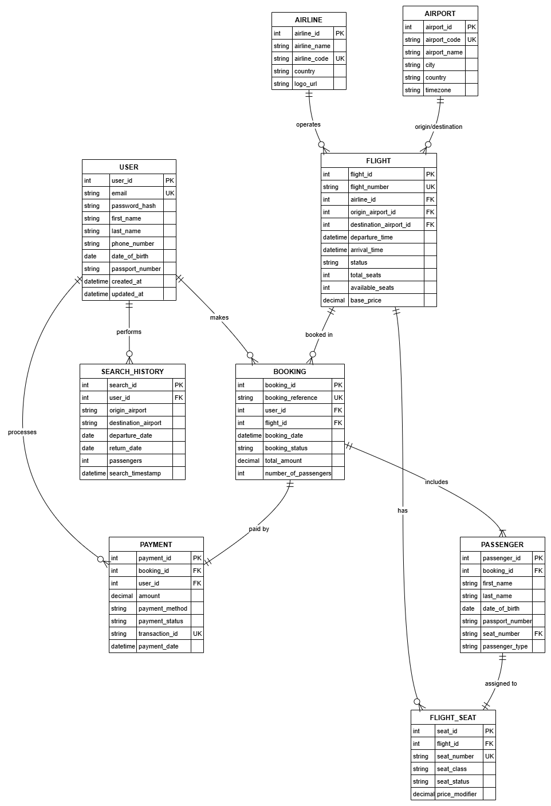

# Technical Specifications Document

## 1. Title Page

- **Project Name**: Airline Booking System  
- **Version**: 1.1  
- **Date**: November 7, 2025  
- **Author(s)**: Group 2 Members  

---

## 2. Table of Contents

1. [Introduction](#3-introduction)  
2. [Overall Description](#4-overall-description)  
3. [Visual Mockup Reference](#5-visual-mockup-reference)  
4. [Features](#6-features)  
5. [Functional Requirements](#7-functional-requirements)  
6. [Non-Functional Requirements](#8-non-functional-requirements)  
7. [Data Requirements](#9-data-requirements)  
8. [External Interface Requirements](#10-external-interface-requirements)  
9. [Glossary](#11-glossary)  
10. [Appendices](#12-appendices)  

---

## 3. Introduction

- **Purpose**  
  To develop a basic airline booking system that enables users to search for flights, book tickets, purchase add-ons, and manage their bookings efficiently.

- **Scope**  
  The MVP includes flight search, booking, ticket management, payment processing, and the purchase of key add-on services (meals, shop items, baggage fees).  
  It excludes advanced features such as seat selection, loyalty programs, or multi-city bookings.

- **Definitions, Acronyms, and Abbreviations**  
  - **PNR**: Passenger Name Record  
  - **API**: Application Programming Interface  
  - **ERD**: Entity-Relationship Diagram  

---

## 4. Overall Description

- **Product Perspective**  
  The system is a standalone web application aimed at customers and airline staff to manage flight bookings and associated purchases.

- **Product Functions**  
  - Flight search by date, origin, and destination  
  - Booking creation and confirmation  
  - Ancillary service purchase (meals, shop items, baggage fees)  
  - User registration and login  
  - Payment gateway integration for ticket and add-on purchase  
  - Booking viewing and cancellation  

- **User Classes and Characteristics**  
  - **End Users**: Customers searching and booking flights, and purchasing add-ons  
  - **Admin Users**: Airline staff managing flight schedules, inventory, and bookings in the backend  

- **Operating Environment**  
  - Client: Modern web browsers (Chrome, Firefox, Safari)  
  - Server: Web backend (e.g., Node.js, Python) with relational or NoSQL database  

- **Assumptions and Dependencies**  
  - Reliable internet connectivity for users  
  - Availability of a payment gateway API (e.g., Stripe, PayPal)  

---

## 5. Visual Mockup Reference

Design wireframes/screenshots should include the following pages:
- Landing/Home  
- Login/Sign-up  
- Search Results  
- Flight Selection/Details  
- Book a Flight  
- Booking Confirmation  
- My Bookings  
- User Profile/Account  

**Live design available on Figma:**  
[Airline Booking System UI/UX](https://www.figma.com/file/2TIfAaviZLvRTfY95KbdWj/Airline-Booking-System-UI-UX?node-id=0-4&t=rJMVaOfTQaEewtvx-0)

---

## 6. Features

- Search flights by destination, date, and time  
- Register and log in securely  
- Book flights and confirm reservations  
- View and manage existing bookings  
- Purchase additional services (meals, baggage, shop items)  
- Integrated payment gateway for secure transactions  
- Admin dashboard for managing flight schedules and inventory  

---

## 7. Functional Requirements

1. **User Authentication**
   - Users must be able to register and log in with valid credentials.
2. **Flight Search**
   - Users must be able to search for available flights based on origin, destination, and date.
3. **Booking Management**
   - Users can create, view, and cancel bookings.
4. **Payment Processing**
   - Users must be able to pay for tickets and add-ons through an integrated payment gateway.
5. **Add-on Services**
   - System allows the purchase of meals, baggage, and in-flight shop items.
6. **Admin Management**
   - Admin users can add, edit, or delete flight schedules and manage bookings.

---

## 8. Non-Functional Requirements

- **Performance**: The system should handle multiple concurrent users without performance degradation.  
- **Security**: Sensitive information such as passwords and payment details must be encrypted.  
- **Availability**: The system should maintain 99% uptime.  
- **Usability**: The interface should be intuitive and responsive across devices.  
- **Scalability**: The system architecture should support expansion of services and features.  
- **Maintainability**: Codebase should be modular and easy to update.  

---

## 9. Data Requirements

- **Entity-Relationship Diagram (ERD):**  
  

---

## 10. External Interface Requirements

- **User Interface (UI):**  
  Browser-based web interface accessible via modern web browsers.  
- **Software Interfaces:**  
  Integration with third-party payment APIs such as PayPal or Stripe.  
- **Hardware Interfaces:**  
  Standard computing devices (desktop, laptop, or mobile).  
- **Communications Interfaces:**  
  Internet connection required for all user interactions and API calls.  

---

## 11. Glossary

| Term | Definition |
|------|-------------|
| **PNR** | Passenger Name Record |
| **API** | Application Programming Interface |
| **ERD** | Entity-Relationship Diagram |
| **MVP** | Minimum Viable Product |

---

## 12. Appendices

- **A. Design Reference:**  
  [Airline Booking System UI/UX on Figma](https://www.figma.com/file/2TIfAaviZLvRTfY95KbdWj/Airline-Booking-System-UI-UX?node-id=0-4&t=rJMVaOfTQaEewtvx-0)  
- **B. System Diagrams:**  
  See `ERD/erd2.png` for data model visualization.  

